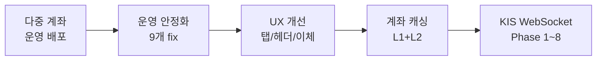
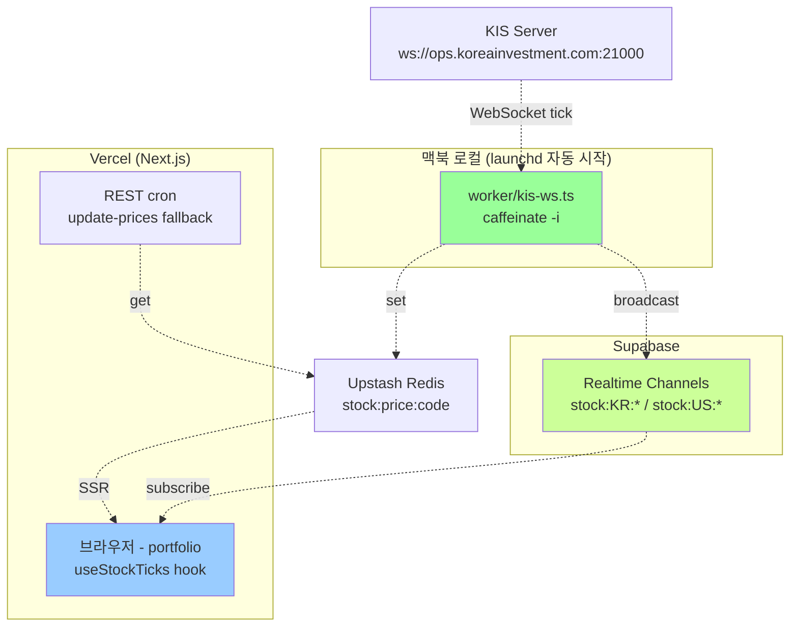

# 🌅 2026-05-12 작업 브리핑

> 어젯밤 ~ 오늘 새벽에 진행한 작업 요약과, **잠 깬 후 본인이 할 일**을 정리합니다.

---

## 🚀 본인이 지금 할 일 (10분)

> 핵심 한 가지: **Supabase env 3개 추가 → 워커 실행 → 자동 시작 등록**.
> 이 단계 마치면 실시간 시세가 운영에서 동작합니다.

### 체크리스트

- [ ] **1. Supabase 키 복사** (https://supabase.com/dashboard → 본인 프로젝트 → Settings → API)
  - Project URL
  - `anon` `public` key
  - `service_role` `secret` key (⚠️ 클라이언트 노출 금지)

- [ ] **2. `.env.development.local` 에 3줄 추가**
  ```bash
  NEXT_PUBLIC_SUPABASE_URL=https://xxx.supabase.co
  NEXT_PUBLIC_SUPABASE_ANON_KEY=eyJhbGci...
  SUPABASE_SERVICE_ROLE_KEY=eyJhbGci...
  ```

- [ ] **3. Vercel Project Settings → Environment Variables 에 2개만 추가**
  - `NEXT_PUBLIC_SUPABASE_URL`
  - `NEXT_PUBLIC_SUPABASE_ANON_KEY`
  - (SERVICE_ROLE 은 운영엔 불필요 — 워커는 맥북 로컬에서만 동작)
  - 추가 후 Vercel 에서 **Redeploy 1회**

- [ ] **4. 워커 로컬 실행 검증**
  ```bash
  npm run worker:dev
  ```
  예상 출력:
  ```
  [kis-ws] Supabase Realtime 활성
  [kis-ws] Upstash Redis 활성
  [kis-ws] 장 외 시간 — 5분 후 재체크   (장 외라면)
  [kis-ws] connecting ...               (장중이면)
  [kis-ws] + register H0STCNT0:005930
  ```
  → `Ctrl+C` 로 종료

- [ ] **5. launchd 자동 시작 등록 (1회)**
  ```bash
  ./scripts/install-worker.sh
  tail -f ~/Library/Logs/snapshot-kis-ws.log
  ```
  → 로그인 시 자동 시작, 슬립에도 가동, 충돌 시 자동 재시작

- [ ] **6. 평일 09:00 이후 브라우저 검증**
  - `/dashboard/portfolio` 진입
  - 한국 종목 가격이 1-3초 간격 변동되면 성공
  - 미국 종목은 KST 22:30 이후 미국 장 열리면 동일

상세: [`docs/kis-websocket.md`](./kis-websocket.md)

---

## 🏗️ 어제 작업한 것 (commit 18개, 운영 push 완료)



### A. 다중 계좌 운영 DB 적용 + 첫 push 실패 → fix

| commit | 내용 |
|--------|------|
| `9da6e54` | `BrokerageAccount` 모델 + 마이그레이션 + 운영 DB 적용 (백업 후) |
| `0a3583b` | **Vercel 빌드 실패 fix** — prisma 3종 7.8.0 통일 (이전 ^7.1.0 핀이 mismatch 유발) |

**교훈**: push 전 `npm run build` 풀빌드 검증 필수. type-check 만으로 부족.

### B. 운영 안정화 (race condition / cache / i18n)

| commit | 내용 |
|--------|------|
| `b8cfd97` | 한국어 조사 처리 (`을(를)` → 자연스러운 문장) |
| `ba92d7c` `997fdbe` | Upstash 환경변수 graceful + `staleTimes.dynamic=0` |
| `48b3932` `bec731d` | 계좌 flicker / cleanup race fix |
| `a159563` | mutation 후 RSC payload cache 무효화 |
| `71e2834` | dev 환경에서 운영 Redis 사용 차단 |
| `5b4e2d8` | native confirm/alert 13곳 → 커스텀 다이얼로그/toast 일관화 |

### C. UX 개선 + 신규 기능

| commit | 내용 |
|--------|------|
| `36363f2` | USD 종목 추가 시 **매입환율 input 노출** + 검색 결과 중복(HIMS 2개) dedup |
| `616f5c3` | 🆕 **주식이체 기능** — A계좌 → B계좌 부분/전체 이체 (가중평균 merge) |
| `368ee8e` | 계좌별 모드에 **계좌 탭 필터** + 헤더에 평가/매입/수익 3종 표시 |
| `c82fb3c` | 통합 모드/단일 계좌도 동일 포맷 합계 헤더 |
| `b8db52d` | 합계/그룹 헤더에 **"주가 N분 전"** timestamp |

### D. 계좌 캐싱 (L1 + L2)

| commit | 내용 |
|--------|------|
| `097c3d4` | accountService 에 **Upstash Redis L2** + accounts-client 에 **localStorage L1 SWR** + `priceUpdatedAt` 누락 fix |

- 계좌 관리 페이지 진입 시 매번 DB 쿼리 → **체감 로딩 0ms** (localStorage 즉시 표시 + 백그라운드 fetch)
- 계좌 CUD + 종목 변이 모두 자동 invalidate

### E. KIS WebSocket 실시간 시세 — 가장 큰 작업

| commit | Phase | 내용 |
|--------|-------|------|
| `8db3b97` | 1 | PoC — 삼성전자 콘솔 로그 |
| `6f262df` | 2~8 | 풀스택 통합 |

---

## 📡 KIS WebSocket 아키텍처 (E 작업 상세)



**핵심 흐름**:
1. **장중**: 워커가 KIS WebSocket 으로 tick 받음 → Supabase Realtime 으로 브라우저에 즉시 push + Redis 에도 캐시
2. **장 마감/주말**: 워커가 WebSocket 끊고 sleep → 클라이언트는 기존 REST + Redis 4h 캐시로 자동 fallback (회귀 0)
3. **워커 미가동/맥북 꺼짐**: 동일하게 fallback. 사용자 본인이 노트북 켜둘 때만 실시간 받음

**Phase 진행**:

| Phase | 내용 |
|-------|------|
| 1 | KIS Approval 토큰 발급 + WebSocket 연결 + 단일 종목 콘솔 출력 |
| 2 | Supabase Realtime broadcast + 클라이언트 hook (`useStockTick`, `useStockTicks`) |
| 3 | 다종목 동적 구독 — DB holdings 합집합 30초 polling |
| 4 | portfolio-client 의 holdings 자동 갱신 (currentPrice → currentValue/profit 재계산) |
| 5 | 자동 재연결 (exponential backoff) + ping/pong + 장 외 sleep |
| 6 | 해외(HDFSCNT0) 통합 — 미국 주식 (NAS/NYS/AMS) |
| 7 | `scripts/install-worker.sh` — launchd plist + caffeinate |
| 8 | launchd 로그 파일 `~/Library/Logs/snapshot-kis-ws.{log,err.log}` |

---

## 🤖 best practice 로 자동 결정한 사항

자고 계실 동안 결정 필요한 부분은 best practice 로 진행했습니다.

| # | 결정 | 근거 |
|---|------|------|
| 1 | 모노레포 `worker/` | Prisma/KIS 토큰 공유, Vercel 빌드는 worker/ 무시 |
| 2 | Supabase Realtime broadcast | 이미 Supabase 사용중 + 무료 |
| 3 | 종목별 채널 `stock:{KR\|US}:{code}` | 클라이언트가 자기 보유 종목만 구독, 효율 |
| 4 | 30s polling holdings 합집합 | 본인 1명이라 충분 단순 |
| 5 | Exponential backoff 1s→60s | 표준 재연결 패턴 |
| 6 | KR 09:00-15:35, US 22:30-05:00 | 정상 거래시간. 휴장일/DST 는 follow-up |
| 7 | launchd `KeepAlive { Crashed: true }` | 의도 종료(`./scripts/uninstall-worker.sh`)는 유지, 충돌만 30초 후 재시작 |
| 8 | env 누락 시 graceful skip | 운영 회귀 위험 0 — 사용자가 env 추가하면 자동 활성 |

---

## ⚠️ 검증 필요 / 미확인

| 항목 | 메모 |
|------|------|
| 장중 실제 tick 수신 | 새벽 작업이라 미검증. **평일 09:00 이후** `npm run worker:dev` 로 확인 필요 |
| HDFSCNT0 필드 순서 | 공식 문서 기준. 미국 종목 보유 시 첫 tick 으로 검증 |
| Supabase Realtime quota | Free 월 2M msg. 30 종목 × 7h × 2 tick/s ≈ 1.5M/월 — 한계 근처. 사용량 모니터 후 throttle 추가 검토 |
| 워커 메모리 누수 가능성 | `channelCache` 가 종목 unregister 시 cleanup 안 함. 장기 가동 시 follow-up |

---

## 📋 Follow-up 큐 (별도 세션)

### 빠른 개선
- [ ] 가격 변동 시 카드 색상 1회 flash 애니메이션
- [ ] dnd-kit hydration 경고 (계좌 페이지)
- [ ] totalCost +0.01 rounding artifact (가중평균 후 server recalc 차이)

### KIS WebSocket 정확화
- [ ] 한국·미국 휴장일 캘린더
- [ ] 미국 DST(서머타임) 정확 처리
- [ ] 워커 채널 cache cleanup (unregister 시)
- [ ] Supabase Realtime 사용량 모니터링/알림

### 안전성
- [ ] `UNIQUE(userId, name)` 계좌 중복 방지 마이그레이션
- [ ] 가격 이상치 (±20%) 경고

---

## 🗂️ 관련 문서

- **KIS WebSocket 기술 가이드**: [`docs/kis-websocket.md`](./kis-websocket.md)
- **다중 계좌 plan**: [`plan.md`](../plan.md)
- **본 브리핑**: `docs/2026-05-12-briefing.md`

---

## 📞 즉시 도움 필요 시

문제 / 막힘 / 다음 작업 시작 시 알려주세요:
- 실시간 시세 안 옴 → `tail -f ~/Library/Logs/snapshot-kis-ws.log` 결과 공유
- Vercel 배포 실패 → 빌드 로그 스크린샷
- 다른 기능 작업 시작 → 자유롭게

> 좋은 하루 되세요 ☕
