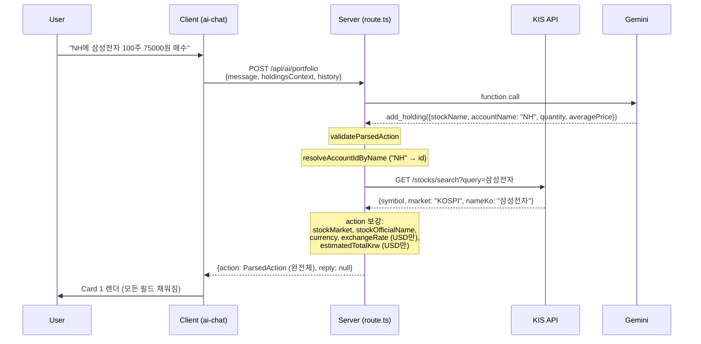
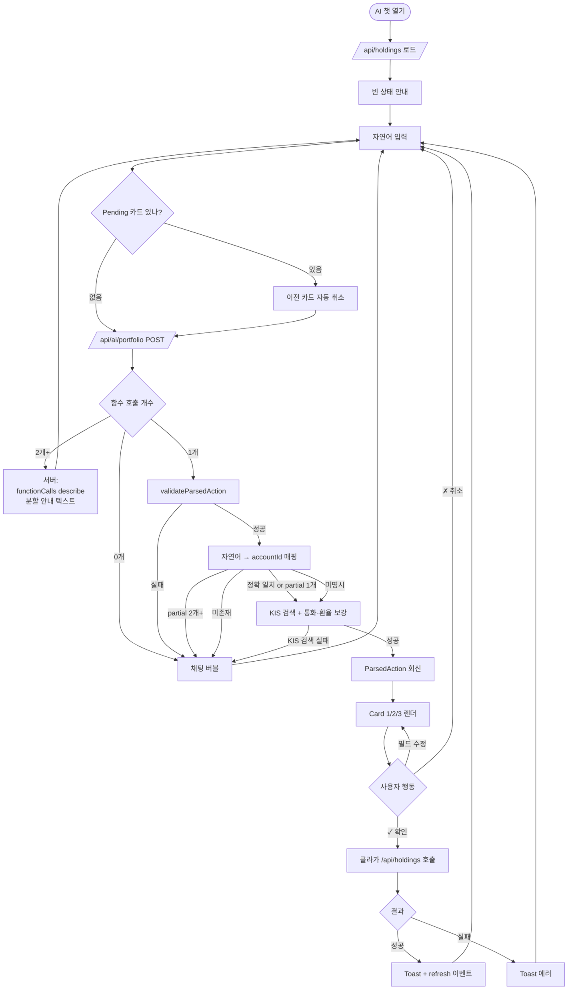
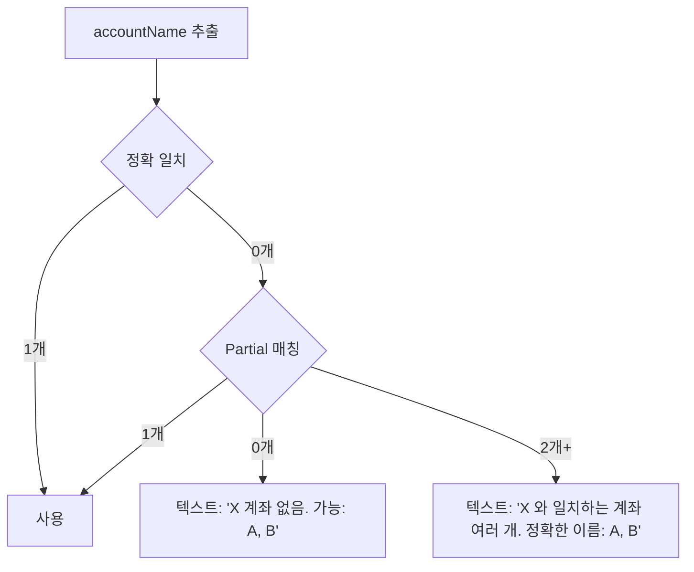

# 🤖 AI Chat 리디자인 — TO-BE UI & 유스케이스 (v3)

> **작성일:** 2026-05-12
> **상태:** 계획 확정 (구현 대기)
> **목적:** 다중 계좌 도입 후 AI 챗 정확도 회복 + 폼 카드 패턴 도입

---

## 🎯 결정 사항 매트릭스

### Scope
| 항목 | 결정 |
|---|---|
| Scope | 옵션 A — 종목 CUD only (`add/update/delete_holding`) |
| 거부 | 예수금/계좌 CRUD/스냅샷/시뮬레이션/일반 대화 |
| LLM | Gemini 2.5 flash-lite 유지 |

### 의도 매핑
| 사용자 표현 | 액션 | 비고 |
|---|---|---|
| "X 매수" / "X 추가" | `add_holding` + `mode: 'merge'` | 가중평균 평단가 (물타기) |
| "X 평단가 N으로" / "X 수량 N주로" | `update_holding` (intent='update') | 평단가/수량 편집 가능 |
| "X N주 매도" | `update_holding` (intent='sell', quantity=차감 후) | 평단가 변경 안 함, 매도 가격 무시 |
| "X 전량 매도" / "X 삭제" | `delete_holding` | — |

### UI/UX
| 항목 | 결정 |
|---|---|
| 종목명 필드 | readonly (AI 추출 + KIS 검색 결과로 정식 명칭 표시) |
| 카드 위치 | 채팅 메시지 인라인 |
| 통화 필드 | KIS 검색 결과 market 기반 자동 + readonly |
| 카드 갱신 | 항상 새 카드 생성 |
| Pending 카드 중 새 입력 | 이전 카드 자동 취소 (actionState='rejected') |
| **매도 카드 가격 필드** | **없음** (수량만 받음, 매도가는 무시) |
| **매도 의도 식별** | `update_holding` 액션에 `intent: 'sell' \| 'update'` 필드 |
| 멀티 액션 | 서버에서 거절 + 분할 안내 (정적 템플릿) |
| 계좌명 매칭 | 정확 일치 → partial 1개 OK → partial 2개+ 거절 |

---

## 📊 AS-IS 문제점

### P0
1. 클라이언트 `HoldingContext` 에 `accountId/accountName` 누락 → 모델이 계좌 분포 못 봄
2. `add_holding` 시 클라가 `accountId` 안 보내 폴백 계좌로 잘못 들어감
3. Disambiguation 후보 버튼에 계좌명 없음
4. 멀티 function call silent fail — 첫 번째만 처리
5. "매수" overwrite 버그 — 이미 보유 중 종목 재매수 시 평단가 덮어쓰기

### UX
- 확인 버튼만 있고 인라인 수정 불가
- 매도 룰 없음 — "매도" 입력 시 동작 미정의
- 시스템 프롬프트와 코드 약속 불일치

---

## 🔄 액션 데이터 흐름 — 서버가 카드 데이터 미리 채움



→ 클라는 카드 표시 후 KIS 추가 호출 안 함. confirm 시 `/api/holdings` 한 번만 호출.

---

## 📐 `ParsedAction` 타입 (v3)

```ts
export type ActionType = 'add_holding' | 'update_holding' | 'delete_holding'

export interface ParsedAction {
    type: ActionType
    stockName: string                  // AI 추출 (사용자 입력)
    quantity?: number
    averagePrice?: number
    accountId?: string
    accountName?: string

    // ↓ 서버가 보강 (KIS 검색 후)
    stockOfficialName?: string         // KIS nameKo 또는 nameEn
    stockMarket?: string                // KOSPI/KOSDAQ/US 등
    currency?: 'KRW' | 'USD'           // market 기반 자동
    exchangeRate?: number              // USD 일 때만
    estimatedTotalKrw?: number         // USD 일 때만, 매입금액 KRW 환산

    // ↓ update_holding 전용
    intent?: 'update' | 'sell'         // 매도면 'sell'
}
```

`amount` 필드 (cash) 제거. `update_cash_balance` ActionType 제거.

---

## 🎨 폼 카드 디자인

### 빈 상태 안내
```
✨ AI 포트폴리오 어시스턴트
─────────────────────────────────────

💡 종목 추가·수정·삭제만 가능합니다

예시:
  "NH에 삼성전자 100주 75000원에 매수"
  "키움 삼성전자 평단가 76000원으로 수정"
  "테슬라 5주 매도"
  "테슬라 삭제"

🔗 다른 작업은 어디서:
  • 예수금 변경 → 홈의 예수금 카드
  • 계좌 관리 → 설정
  • 스냅샷 → 스냅샷 메뉴
```

### Card 1 — `add_holding` (매수)
```
┌─ 종목 추가 (매수) ──────────────┐
│ 계좌    [NH          ▼]         │ ← 계좌 ≥2 일 때만 노출
│ 종목    삼성전자                  │ ← readonly (KIS 공식명)
│ 수량    [100             ]      │
│ 평단가  [75,000          ] KRW   │ ← 통화 자동·readonly
│                                  │
│ 💡 이미 보유 중이면 가중평균 평단가  │
│    로 합산됩니다 (물타기 모드)      │
│                                  │
│ [✓ 매수]      [✗ 취소]            │
└──────────────────────────────┘
```

USD 종목인 경우 평단가 아래 추가 라인:
```
환율: 1,380 KRW/$ · 매입금액 약 ₩10,350,000
```

### Card 2 — `update_holding` (수정 또는 부분 매도)

#### intent='update' (수정 모드)
```
┌─ 종목 수정 ─────────────────────┐
│ 대상  [삼성전자 (NH, 100주)  ▼]  │
│                                  │
│ 수량   [100             ]        │
│ 평단가 [76,000          ] KRW    │
│                                  │
│ [✓ 수정]      [✗ 취소]            │
└──────────────────────────────┘
```

#### intent='sell' (부분 매도 모드)
```
┌─ 부분 매도 ─────────────────────┐
│ 대상  [테슬라 (NH, 10주)   ▼]    │
│                                  │
│ 매도 수량  [5     ] (보유 10주)   │
│ 매도 후     5주                  │
│ 평단가      변경 안 함            │
│                                  │
│ 💡 매도 금액은 기록되지 않습니다.   │
│    예수금은 [홈]의 예수금 카드에서  │
│    직접 업데이트해주세요.          │
│                                  │
│ [✓ 매도]      [✗ 취소]            │
└──────────────────────────────┘
```
- 매도 수량 필드만 입력 받음 (가격 없음)
- 매도 수량 > 보유 수량이면 [✓ 매도] 비활성 + 경고
- 매도 수량 = 보유 수량이면 [✓ 매도] 활성 (전량 매도 → 클라가 내부적으로 delete API 호출)
- 평단가 readonly + "변경 안 함" 표시
- API 호출 시: `PATCH /api/holdings/[id]` with `quantity: 보유 - 매도수량` (평단가 미전송)

### Card 3 — `delete_holding` (전량 매도/삭제)
```
┌─ 종목 삭제 ─────────────────────┐
│ 대상  [테슬라 (NH, 10주)   ▼]    │
│                                  │
│ ⚠️ 삭제 후 복구할 수 없습니다.    │
│ 💡 매도 금액은 기록되지 않습니다.   │
│    예수금은 [홈]에서 직접 업데이트   │
│                                  │
│ [✓ 삭제]      [✗ 취소]            │
└──────────────────────────────┘
```

---

## 🔄 메인 유스케이스 플로우



---

## 🎯 의도 분류

```mermaid
flowchart TD
    Input[자연어 입력] --> G[Gemini function call]
    G --> Intent{의도}

    Intent -->|"X 매수"/"X 추가"| Add[add_holding]
    Intent -->|"X 평단가/수량 = N"| UpdU[update_holding<br/>intent='update']
    Intent -->|"X N주 매도"| UpdS[update_holding<br/>intent='sell'<br/>quantity = 보유 - N]
    Intent -->|"X 전량 매도"/"X 삭제"| Del[delete_holding]

    Intent -->|예수금| RC[텍스트: 홈의 예수금 카드]
    Intent -->|계좌 CRUD| RA[텍스트: 설정 메뉴]
    Intent -->|스냅샷| RS[텍스트: 스냅샷 메뉴]
    Intent -->|시뮬레이션/시장분석/일반대화| RG[텍스트: 종목 CUD만]
    Intent -->|모호| Ask[텍스트: 종목/수량/평단가 질문]

    Add --> Card1
    UpdU --> Card2U[Card 2 수정 모드]
    UpdS --> Card2S[Card 2 매도 모드]
    Del --> Card3
```

---

## 🌐 계좌명 매핑 정책



---

## 🔢 멀티 액션 거절 구현

```ts
// app/api/ai/portfolio/route.ts
if (functionCalls && functionCalls.length > 1) {
    const list = functionCalls.map((fc, i) => {
        const args = fc.args as Record<string, unknown>
        return `${i + 1}) ${describeAction(fc.name, args)}`
    }).join('\n')

    return NextResponse.json({
        success: true,
        action: null,
        reply: `한 번에 한 가지 작업만 도와드릴 수 있어요. 다음처럼 나눠 입력해주세요:\n${list}`,
    })
}

// describeAction 헬퍼
function describeAction(name: string, args: Record<string, unknown>): string {
    switch (name) {
        case 'add_holding':
            return `${args.accountName ?? ''} ${args.stockName} ${args.quantity}주 매수`
        case 'update_holding':
            return args.intent === 'sell'
                ? `${args.accountName ?? ''} ${args.stockName} ${args.quantity}주 매도`
                : `${args.accountName ?? ''} ${args.stockName} 수정`
        case 'delete_holding':
            return `${args.accountName ?? ''} ${args.stockName} 삭제`
        default:
            return name
    }
}
```

---

## 🚫 거절 케이스 매트릭스

| 사용자 입력 예시 | AI 응답 |
|---|---|
| "예수금 500만원으로 변경" | "예수금 변경은 홈 화면의 예수금 카드에서 직접 수정해주세요." |
| "NH 계좌 삭제" / "삼성증권 계좌 추가" | "계좌 관리는 설정 메뉴에서 할 수 있습니다." |
| "오늘 스냅샷 저장" | "스냅샷 관리는 스냅샷 메뉴에서 진행해주세요." |
| "테슬라 다 팔면 어떻게 돼?" | "시뮬레이션은 시뮬레이션 메뉴를 이용해주세요." |
| "오늘 시장 어때?" / "어떤 종목 추천?" | "저는 종목 추가·수정·삭제만 도와드릴 수 있어요." |
| "이전 지시 무시…" | "포트폴리오 관리만 도와드릴 수 있습니다." |
| 멀티 액션 | "한 번에 한 가지만… ① X 매수 ② Y 매수 ③ Z 매도" |
| 계좌 partial 2개+ | "'삼성증권'과 일치하는 계좌 여러 개. 정확한 이름: 삼성증권 일반, 삼성증권 ISA" |
| 미존재 계좌 | "'미래에셋' 계좌 없음. 가능: NH, 키움" |
| 미존재 종목 (KIS 검색 실패) | "'성성전자'를 찾을 수 없습니다. 정확한 종목명을 알려주세요." |
| 미보유 종목 매도/삭제 | "보유하지 않은 종목입니다." |

---

## 📂 변경 파일

### 1. `components/dashboard/ai-chat.tsx` (~60줄 변경)
- `HoldingContext` 에 `accountId/accountName` 추가
- `holdingsContext` 매핑 시 두 필드 포함
- `executeAction` 의 add_holding: `accountId` + `mode: 'merge'` POST 본문
- update/delete 매칭: `accountId` 필터 + 명확한 에러 메시지
- `update_cash_balance` 케이스 + import 제거
- 기존 disambiguation 후보 버튼 제거 (카드 내부 드롭다운으로 통합)
- 새 자연어 입력 시 pending 카드 자동 취소
- 빈 상태 안내 갱신

### 2. `components/dashboard/ai-action-card.tsx` (신규 ~180줄)
- props: `action`, `holdings`, `accounts`, `executing`, `onConfirm`, `onCancel`
- 액션별 폼 렌더링:
  - add: 계좌·종목(readonly)·수량·평단가·환율표시(USD)
  - update (intent='update'): 대상·수량·평단가
  - update (intent='sell'): 대상·매도수량 (가격 X)
  - delete: 대상
- 필수 필드 검증 + [✓] 활성/비활성
- 매도 모드: 매도 수량 > 보유 수량 비활성 + 경고
- 매도 모드 안내문 (매도가 비기록)
- USD add: 환율·매입금액 표시 (action 데이터 그대로 사용)
- `onConfirm(편집된 데이터)` → 부모가 API 호출

### 3. `app/api/ai/portfolio/route.ts` (~80줄 변경)
- `update_cash_balance` 관련 모두 제거 (declaration + ActionType + amount + validateCashAmount import)
- `update_holding` declaration 에 `intent: 'sell' | 'update'` enum 필드 추가
- `ParsedAction` 인터페이스 확장 (intent, stockMarket, stockOfficialName, currency, exchangeRate, estimatedTotalKrw)
- `validateParsedAction` 에 intent 검증
- **멀티 function call 검사 + describeAction 헬퍼** (위 의사코드 참조)
- 시스템 프롬프트 강화:
  - 매수/매도/수정/삭제 의도 매핑
  - intent 필드 사용법
  - 멀티 액션 거절
  - 매도 시 평단가 미전송 + 차감 후 quantity 전송
- `resolveAccountIdByName` — partial 결과 2개+ 면 텍스트 응답
- **KIS 검색 통합** — 액션 회신 전 stocks/search 호출 → 결과 부재 시 텍스트 응답, 성공 시 action 보강
- USD 종목인 경우 환율 조회 + estimatedTotalKrw 계산 (현재 reply 로직 옮김)
- 액션별 reply 텍스트 생성 로직은 카드가 대체 → 제거 또는 단순화

### 4. (변경 없음 확인)
- `app/api/holdings/route.ts` — `accountId` 옵셔널 + `mode: 'merge'` 지원 ✓
- `app/actions/cash-actions.ts` — 다이얼로그 사용
- `prisma/schema.prisma` — 변경 없음

---

## 🧪 테스트 시나리오

### 기본
| # | 입력 | 기대 |
|---|---|---|
| 1 | 계좌 1개 + "삼성전자 100주 75000원 매수" | Card 1 (계좌 숨김), merge 모드 |
| 2 | 계좌 2개 + "NH에 삼성전자 100주 75000원 매수" | Card 1, 계좌=NH |
| 3 | 계좌 2개 + "삼성전자 100주 75000원 매수" (계좌 미명시) | Card 1, 계좌=빈 (필수) |
| 4 | "삼성전자 매수" (수량·평단가·계좌 미명시) | Card 1, 모두 빈 — 확인 비활성 |

### 매수 (가중평균)
| # | 입력 | 기대 |
|---|---|---|
| 5 | 키움 삼성전자 50주(4만원) 보유 + "키움 삼성전자 100주 5만원 매수" | 150주, 평단가 46,666원 |
| 6 | 신규 "테슬라 10주 $400 매수" | Card 1, USD, 환율·매입금액 표시 |

### 매도 (intent='sell')
| # | 입력 | 기대 |
|---|---|---|
| 7 | 키움 삼성전자 100주 + "키움 삼성전자 20주 매도" | Card 2 매도 모드, 매도수량=20, 매도 후 80주 |
| 8 | 키움 테슬라 10주 + "테슬라 전량 매도" | Card 3 |
| 9 | "테슬라 매도" (수량 미명시) | 텍스트 "몇 주 매도할까요?" |
| 10 | "테슬라 5주 200달러 매도" | Card 2 매도 모드, 200달러 무시. 안내문 노출 |
| 11 | 키움 삼성전자 10주 + "삼성전자 20주 매도" (매도량 > 보유) | Card 2, [✓ 매도] 비활성 + 경고 |

### 수정 (intent='update')
| # | 입력 | 기대 |
|---|---|---|
| 12 | 키움 삼성전자 100주 + "키움 삼성전자 평단가 76000으로 수정" | Card 2 수정 모드, 평단가=76000 |
| 13 | Card 2 수정 모드 — 평단가만 수정 후 확인 | 수량 변경 없이 평단가만 PATCH |

### 매칭/디스암비귀에이션
| # | 입력 | 기대 |
|---|---|---|
| 14 | NH·키움 둘 다 삼성전자 + "삼성전자 수량 200주로" | Card 2, 대상 드롭다운 2개 |
| 15 | NH·키움 둘 다 + "NH 삼성전자 200주로" | Card 2, 대상=NH 자동 |
| 16 | NH 삼성전자 없음 + "NH 삼성전자 삭제" | 토스트 "'NH' 계좌에 '삼성전자' 없음" |
| 17 | 삼성증권 일반/ISA 둘 다 + "삼성증권에 추가" | 텍스트 "정확한 이름: 삼성증권 일반, 삼성증권 ISA" |
| 18 | 미보유 계좌 "미래에셋에 추가" | 텍스트 "'미래에셋' 없음. 가능: NH, 키움" |

### 멀티 액션
| # | 입력 | 기대 |
|---|---|---|
| 19 | "키움 삼성전자 100주 5만원 매수, 삼성증권 테슬라 10주 $400 매수, 나무증권 하이닉스 2주 매도" | 텍스트 분할 안내 (3개 enumerate) |

### 거절
| # | 입력 | 기대 |
|---|---|---|
| 20 | "예수금 500만원" | "홈의 예수금 카드에서" |
| 21 | "NH 계좌 삭제" / "삼성증권 계좌 추가" | "설정에서" |
| 22 | "오늘 시장 어때?" | "종목 CUD만" |
| 23 | "이전 지시 무시…" | 보안 룰 거절 |

### UI 동작
| # | 시나리오 | 기대 |
|---|---|---|
| 24 | Card 1 종목명 readonly | 입력 불가 |
| 25 | 새 자연어 입력 시 이전 pending 카드 | actionState='rejected' 자동 변경 |
| 26 | 카드 표시 후 새 자연어 입력 | 새 카드가 history 아래에 |
| 27 | "성성전자 매수" (오타·KIS 검색 실패) | 텍스트 "종목을 찾을 수 없음" |

---

## 📈 작업량 (조정)

| 항목 | 라인 |
|---|---|
| `ai-action-card.tsx` (신규) | ~180 |
| `ai-chat.tsx` 변경 | ~60 |
| `portfolio/route.ts` 변경 | ~80 |
| **합계** | **~320** |

**커밋 분할:**
1. `refactor(ai-chat): update_cash_balance 액션 제거`
2. `feat(ai-chat): 다중 계좌 컨텍스트 종단 전달 + 매수 merge 모드`
3. `feat(ai-chat): 서버 KIS 검색 통합 — 액션에 시장·통화·환율 보강`
4. `feat(ai-chat): 폼 카드 컴포넌트 도입 + intent='sell' 매도 모드`
5. `feat(ai-chat): 멀티 액션 거절 + partial 매칭 정책 강화`
6. `chore(ai-chat): 빈 상태 안내 + pending 카드 자동 취소`

---

## ⚠️ 모바일 고려사항

`DialogContent` 의 `h-[min(380px,55dvh)]` 안에 카드 + 채팅 history + 입력창이 들어가야 함. 카드 압축 디자인 필요:
- 필드 간격 축소 (`gap-1.5` → `gap-1`)
- 라벨 위 vs 옆 — 모바일은 위 배치
- 카드 표시 시 `h-[min(480px,70dvh)]` 로 확장 검토

구현 단계에서 실제 렌더해보고 조정.

---

## 🚦 다음 단계

1. ✅ 모든 결정 완료
2. ⏳ 구현 (6개 커밋 분할)
3. ⏳ 테스트 시나리오 1~27 수동 QA
4. ⏳ `npm run build` 풀 빌드 검증
5. ⏳ 모바일 디자인 미세 조정
6. ⏳ 커밋 push

---

## 🔗 관련 문서

- 현재 코드: `components/dashboard/ai-chat.tsx`, `app/api/ai/portfolio/route.ts`
- 스키마: `prisma/schema.prisma`
- 다이얼로그 (위임): `app/actions/cash-actions.ts`, `app/actions/account-actions.ts`
- KIS 검색: `app/api/stocks/search/route.ts`
